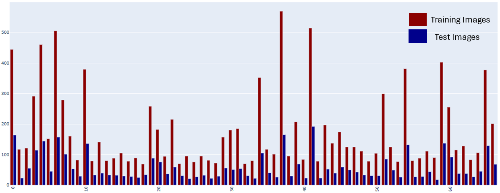

# Treinamento de Pytorch: Classificação de imagens de áreas internas (MIT)

# Links de acesso:
- [Link de acesso para o Google Colab](https://colab.research.google.com/drive/1jj6spffyWsOssE5A6vTQb8d991EpFpRE?usp=sharing)
- pytorch_indoor_img_class.ipynb
- [Link de acesso para o Portfólio](https://meduardaeneves.github.io/portfolio/personal-projects/pytorch_indoor_img_class/)

# Objetivos do projeto
- O objetivo do projeto é usar Pytorch para a classificação de imagens de ambientes internos
- Os dados foram coletados através do [Site do MIT](https://web.mit.edu/torralba/www/indoor.html)

# Descrição da Técnica escolhida para a Solução do problema
Para solucionar o problema em questão, este projeto optou por fragmentar a o desenvolvimento técnico em três partes:
1. Carregamento dos Dados:
2. Pré-Processamento dos Dados
3. Aplicação do modelo do Pytorch

## Carregamento dos Dados
- Os dados foram carregados diretamente do diretório do MIT, usando códigos específicos, sem precisar baixá-los diretamente na máquina. Abaixo estão apresentados estes códigos:
    - Carregamento do dataset no .ipynb: !wget http://groups.csail.mit.edu/vision/LabelMe/NewImages/indoorCVPR_09.tar
    - Despacotamento das imagens: Images unpacking: !tar -xvf indoorCVPR_09.tar
- Depois deste processo as imagens estavam disponíveis para serem trabalhadas
- O DataSet completo contém 67 classes e um total de 15620 imagens. A quantidade de imagens varia dentre as categorias existentes
- Um exemplo da categoria "winecellar" pode ser visto abaixo

## Pré-Processamento dos Dados
- O modelo utilizado para treinar as imagens é um modelo pré-treinado, entretanto, antes de ser aplicado, é necessário realizar pré-processamento nas imagens
- Foi utilizado o "Pytorch transformers" para aplicar DataAugmentation no DataSet, isso fez com que as imagens, dentro de uma mesma classe, tivessem uma maior variação, permitindo melhor classificação
- O DataSet foi fragmentado em treinamento e teste, onde este último recebeu 25% dos dados.
- Com o DataSet pronto, deu-se início a criação do DataLoad de treinamento e de teste, são esses os que serão utilizados pelo modelo para a classificação
- Por fim, é possível observar na imagem abaixo, a quantidade de imagens que existem nas diferentes categorias, nas fases de treinamento e de teste.

- É possível observar que as classes estão desbalanceadas, algumas possuem mais imagens do que outras. É possível que aquelas com menor quantidade de imagens apresentem uma maior dificuldade na fase de classificação.

## Aplicação do modelo do Pytorch
- Para iniciar o processo de classificação foi utilizado um modelo pré-treinado chamado Resnet 18D
- O modelo foi obtido através da [Biblioteca Timm](https://huggingface.co/docs/timm/index)
- Em seguida, o modelo foi treinado por 10 épocas e, a cada momento, os resultados eram salvos a fim de se obter aquele com maior acurácia.
- O modelo final escolhido foi aquele que apresentou a maior acurácia durante a fase de teste

# Resultados
- O melhor modelo testado apresentou os seguintes resultados:
    - Loss de treinamento: 0.1856
    - Acurácia de teste: 0.6804
    - F1 de teste: 0.6758
- A imagem abaixo apresenta a matriz de confusão para os resultados obtidos:

# Consclusão
- De posse dos resultados é possível concluir que o modelo apresentou resultados aceitáveis, com acurácia acima de 67%, porém não excelentes.
- O grupo de imagens que apresentou maior problemas na hora de classificar foi de classe "41" (livingroom), sendo confundida com a classe "6" (bedroom)
